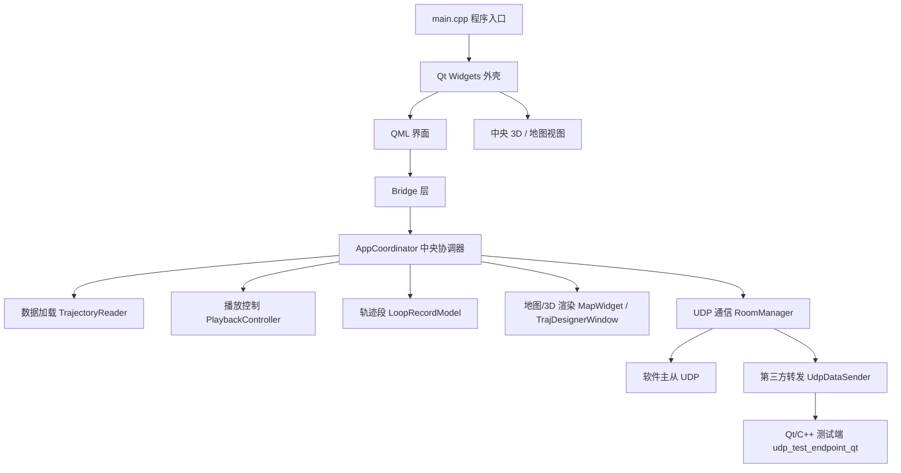
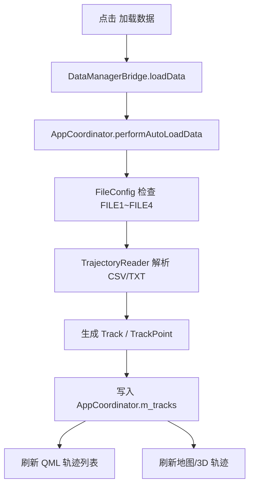
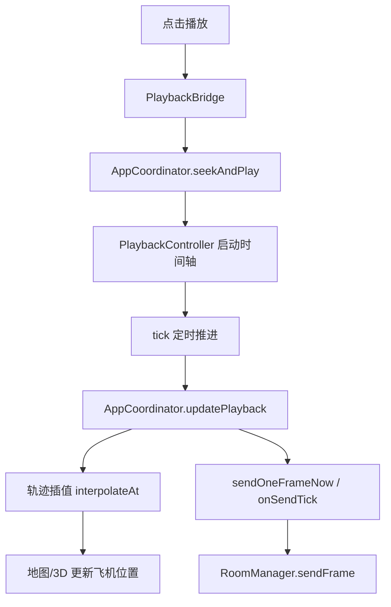

# appMoveTrack 当前程序功能组成说明

日期：2026-06-24  
用途：帮助快速理解当前程序的底层框架、功能模块、数据流程、UDP 通信流程，以及如何向老师解释“这个程序是干什么的、我现在在测什么”。

---

## 1. 一句话概括

`appMoveTrack` 是一个基于 Qt 6.8.3 / C++17 的轨迹数据回放与多机转发控制台。

它的核心功能是：

- 读取 `.csv` / `.txt` 轨迹数据。
- 按字段映射解析出飞机编号、类型、时间、经纬度、高度。
- 在地图 / 3D 视图中播放多架飞机的轨迹。
- 支持主机 / 从机 UDP 通信，把播放轨迹同步给其他节点。
- 支持把播放中的轨迹帧转发给模拟第三方接收端。
- 支持用 Qt/C++ 测试端验证 UDP 收发和接收间隔。

可以向老师这样说：

> 这个程序主要用于轨迹数据加载、轨迹回放、地图/3D 展示，以及通过 UDP 把轨迹帧发送给从机或第三方接收端。我现在重点练的是：生成 10 万条以上轨迹数据，用软件播放，再用 Qt/C++ 模拟第三方接收端接收，并验证接收间隔是否满足 1000ms±30ms。

---

## 2. 技术栈和运行环境

当前项目使用的主要技术：

| 类型 | 内容 |
|---|---|
| 框架 | Qt 6.8.3 |
| 语言 | C++17 |
| 构建工具 | CMake + Ninja |
| 编译器 | MinGW 11.2.0 x64 |
| 前端界面 | QML + Qt Quick Controls |
| 原生图形 | QWidget / QOpenGLWidget / OpenGL |
| 网络通信 | QUdpSocket |
| 配置存储 | JSON |
| 测试端 | Qt/C++ 命令行 UDP 测试程序 |

当前主要可执行文件：

```text
E:\work\bin\appMoveTrack.exe
E:\work\appMoveTrack\local-bin\appMoveTrack.exe
E:\work\bin\udp_test_endpoint_qt.exe
```

注意：

- `E:\work\bin\appMoveTrack.exe` 是 CMake 默认输出位置。
- 你当前实际打开过的程序在 `E:\work\appMoveTrack\local-bin\appMoveTrack.exe`。
- 如果新功能编译后看不到，通常是因为还在运行旧的 `local-bin` 版本。

---

## 3. 程序整体架构

当前程序不是传统的纯 Widget 界面，也不是纯 QML 界面，而是混合架构：

- 外壳由 Qt Widgets 搭建。
- 顶部 / 侧边 / 弹窗等界面用 QML。
- 中央地图 / 3D / 轨迹绘制仍然依赖 C++ 原生组件。
- 业务逻辑集中在 `AppCoordinator`。
- UDP 通信集中在 `RoomManager`。
- 配置和文件映射由 `AppConfig` / `FileConfig` 管理。

简化结构图：



这个架构的核心思想是：

- QML 负责界面展示和按钮交互。
- Bridge 层负责把 QML 的点击转成 C++ 调用。
- `AppCoordinator` 负责统一调度，不让界面直接操作底层逻辑。
- 数据、播放、通信、地图渲染分别由独立模块负责。

---

## 4. 主要目录和关键文件

| 文件 / 目录 | 作用 |
|---|---|
| `main.cpp` | 程序入口，创建窗口、QML 引擎、控制器、Bridge 和依赖注入 |
| `CMakeLists.txt` | 构建配置，声明主程序和 Qt/C++ UDP 测试端 |
| `qml/` | QML 界面文件 |
| `bridge/` | C++ 和 QML 之间的桥接层 |
| `appcoordinator.h/cpp` | 中央业务协调器，程序最核心的调度层 |
| `appconfig.h/cpp` | 项目配置、播放配置、网络配置、显示配置 |
| `fileconfig.h/cpp` | 文件槽位、字段映射、文件名配置 |
| `trajectoryreader.h/cpp` | 轨迹数据解析器 |
| `playbackcontroller.h/cpp` | 播放时间轴、速度、暂停、停止、漂移计算 |
| `looprecordmodel.h/cpp` | 回放片段、裁剪段、是否参与回放 |
| `roommanager.h/cpp` | UDP 主机 / 从机 / 转发状态机 |
| `udpdatasender.h/cpp` | 第三方 UDP 转发发送器 |
| `roomprotocol.h` | 软件主从通信协议格式 |
| `mapwidget.h/cpp` | 地图绘制、轨迹绘制、轨迹点显示 |
| `trajdesignerwindow.h/cpp` | 中央轨迹设计器 / 3D 编辑器 |
| `designerscene3dwidget.h/cpp` | 3D OpenGL 场景 |
| `tools/udp_test_endpoint_qt.cpp` | Qt/C++ UDP 测试端 |
| `config/settings.json` | 当前工作区播放、地图、转发节拍配置 |
| `config/mapping.json` | 当前工作区文件绑定、字段映射、回放段记录 |
| `config/node.json` | 本机节点、转发通道配置 |
| `long_track_120k.csv` | 当前生成的 12 万条长轨迹测试数据 |

---

## 5. 界面功能组成

当前界面主要分为几个部分：

### 5.1 顶部区域

顶部显示：

- 程序标题。
- 当前页面：回放 / 编辑 / 剪裁 / 拼接。
- 播放控制条。
- 地图状态。
- 数据状态。
- 缩放 / 缓存 / 绘制统计。

顶部不是简单装饰，它承担了程序运行状态的反馈作用。

### 5.2 回放页

回放页用于查看已经加载并参与回放的轨迹。

主要显示：

- 当前参与回放的轨迹数量。
- 每条轨迹的编号。
- 每条轨迹的类型。
- 颜色圆点。
- 状态 / 归属选择。

你看到的 `EIGHT001`、`W001`、`ROUTE001` 就是在这里展示。

### 5.3 数据管理页

数据管理页用于选择工作目录、绑定数据文件、配置字段映射、加载数据。

当前数据管理页包括：

- 工作目录。
- FILE1 ~ FILE4 四个文件槽位。
- 每个槽位的文件名。
- 是否可加载。
- 已加载轨迹数量。
- 回放总时长。
- `文件` 按钮：选择文件。
- `映射` 按钮：配置字段映射。
- `解绑` 按钮：取消该 FILE 绑定。
- `加载数据` 按钮。
- `清空已加载` 按钮。
- `手绘模拟` 按钮。

当前配置中：

```text
FILE1 = long_track_120k.csv
FILE2 = 空
```

也就是说现在默认只加载三架新飞机，不再加载 `sim.txt/fada`。

### 5.4 本机 / 节点配置页

本机节点页用于配置软件主从通信：

| 字段 | 含义 |
|---|---|
| 节点名称 | 当前软件节点名称 |
| 本机 IP | 本机局域网 IP 或 127.0.0.1 |
| 主机端口 | 软件作为主机时监听端口，默认 8899 |
| 从机端口 | 软件作为从机时接收端口，默认 8900 |

注意：

- `8899 / 8900` 是软件主从通信端口。
- 老师要求你测的第三方接收端不是这里，而是转发通道里的 `9001`。

### 5.5 转发通道配置

转发通道用于把软件播放中的轨迹转换成简单 `TRACK,...` 文本，发给第三方 UDP 接收端。

当前练习配置：

```text
对端 IP：127.0.0.1
对端端口：9001
本机端口：9101
```

含义：

- 软件从本机 `9101` 发出 UDP。
- 发送到本机 `127.0.0.1:9001`。
- Qt/C++ 测试端监听 `9001`。

---

## 6. 数据加载模块

数据加载主要由这些模块完成：

| 模块 | 职责 |
|---|---|
| `DataManagerPanel.qml` | 用户点击加载、文件、映射、解绑 |
| `DataManagerBridge` | QML 到 C++ 的桥 |
| `FileMappingModel` | 管理 FILE1 ~ FILE4 绑定和状态 |
| `FileConfig` | 读写 `mapping.json` 里的文件映射配置 |
| `TrajectoryReader` | 真正解析 `.csv` / `.txt` 数据 |
| `AppCoordinator::performAutoLoadData` | 串起文件校验、字段映射、读取轨迹、加载到内存 |

数据加载流程：



当前长数据文件：

```text
E:\work\appMoveTrack\long_track_120k.csv
```

字段结构：

```text
objId,objType,utc,longitude,latitude,altitude
```

字段映射：

| 文件字段 | 程序语义 |
|---|---|
| `objId` | 飞机编号 |
| `objType` | 飞机类型 |
| `utc` | 时间 |
| `longitude` | 经度 |
| `latitude` | 纬度 |
| `altitude` | 高度 |

---

## 7. 轨迹数据解析能力

`TrajectoryReader` 支持多种轨迹格式，不是只能读一种 CSV。

当前代码里主要支持：

| 格式 | 说明 |
|---|---|
| `objID, utc, objType, latitude, longitude, altitude` | 一种旧格式 |
| `objID, objType, timestamp, lon, lat, alt` | 当前主要使用格式 |
| `timestamp, lon, lat, alt, objID, objType` | 扩展格式 |
| `timestamp, lon, lat, alt, objID` | 少字段格式 |
| `timestamp, lon, lat, alt` | 单轨迹格式 |
| `lon, lat, alt` | 简单坐标格式 |
| ECEF 坐标 | 如果坐标像地心地固坐标，会尝试转换为经纬高 |

解析后会生成：

```text
Track
  objId
  objType
  color
  logName
  points[]

TrackPoint
  timestamp_ms
  lat
  lon
  alt
  heading
  pitch
  roll
```

其中：

- `Track` 表示一架飞机或一个目标。
- `TrackPoint` 表示某个时间点的位置。
- 如果文件里有多个 `objId`，程序会自动拆成多条轨迹。

---

## 8. 当前生成的长数据说明

当前测试数据：

```text
long_track_120k.csv
```

当前状态：

| 项目 | 内容 |
|---|---|
| 总行数 | 120000 条 |
| 飞机数 | 3 架 |
| 每架点数 | 40000 条 |
| 起始时间 | 2024-01-01 00:00:00.000 |
| 结束时间 | 2024-01-01 00:01:59.997 |
| 总时长 | 约 2 分钟 |

三架飞机：

| 编号 | 轨迹形状 | 区域 | 高度范围 |
|---|---|---|---|
| `EIGHT001` | 8 字轨迹 | `fada` 北侧西部 | 约 860~940 |
| `W001` | W 轨迹 | `fada` 北侧东部 | 约 1260~1340 |
| `ROUTE001` | 大范围穿越 | `fada` 南侧 | 约 1660~1740 |

设计原则：

- 保证数据量超过 10 万条。
- 总时长不要太久，方便练手。
- 三架飞机起飞点不同。
- 三架飞机降落点不同。
- 三架飞机之间不明显相撞。
- 与 `sim.txt` 中的 `fada` 也避开。
- 高度分层，便于解释避让逻辑。

---

## 9. 播放控制模块

播放控制主要由 `PlaybackController` 和 `AppCoordinator` 共同完成。

`PlaybackController` 负责：

- 当前是否播放。
- 当前是否暂停。
- 当前播放时间。
- 播放速度。
- 全局起止时间。
- 回放裁剪范围。
- 定时器 tick。
- 墙钟时间和仿真时间换算。

`AppCoordinator` 负责：

- 点击播放后调用 `seekAndPlay`。
- 每次 tick 后刷新飞机位置。
- 按当前时间插值轨迹点。
- 更新地图 / 3D 中飞机位置。
- 触发 UDP 发送。
- 播放结束后停止并归位。

播放流程：



关键思想：

- 播放不是简单按数组下标递增。
- 程序会根据当前仿真时间，在轨迹点之间插值。
- 这样即使原始数据密度不同，也能按播放时间平滑显示。

---

## 10. 地图和 3D 显示模块

当前程序既有地图显示，也有 3D 显示。

主要模块：

| 模块 | 作用 |
|---|---|
| `MapWidget` | 地图、瓦片、轨迹线、飞机图标、轨迹标记 |
| `TrajDesignerWindow` | 中央统一轨迹设计器窗口 |
| `DesignerScene3DWidget` | OpenGL 3D 场景 |
| `AircraftMarker` | 飞机模型 / 图标绘制 |
| `MapChromeOverlay` | 右上角状态、墙钟、转发统计 |

地图/3D 显示的内容：

- 轨迹线。
- 飞机当前位置。
- 飞机方向。
- 起点 / 终点。
- 回放轨迹段。
- 地图瓦片。
- 3D 坐标轴。
- 当前模式徽标。

当前界面上看到飞机“飞行过程”，核心就是：

```text
PlaybackController 时间推进
AppCoordinator 计算当前位置
MapWidget / DesignerScene3DWidget 绘制飞机和轨迹
```

---

## 11. 回放段和参与回放逻辑

程序里不是所有加载出来的轨迹都一定参与回放。

它有一个“回放段”机制：

- 每条轨迹可以有一个或多个回放段。
- 每段有起始时间和结束时间。
- 每段有是否参与回放的开关。
- 软件发送 UDP 时只发送参与回放的轨迹。

相关模块：

| 模块 | 作用 |
|---|---|
| `LoopRecordModel` | 保存回放段 |
| `AppCoordinator::ensureDefaultPlaybackSegments` | 新轨迹没有回放段时自动补全程段 |
| `AppCoordinator::applyLoopTableToMap` | 把回放段应用到地图和 UDP |
| `DataReplayPanel.qml` | 显示参与回放轨迹 |

当前你加载新数据后，程序会自动给三架飞机补全程回放段，所以能直接播放。

---

## 12. UDP 通信模块

UDP 通信是老师当前最关心的部分之一。

核心模块：

| 模块 | 作用 |
|---|---|
| `RoomManager` | UDP 主机 / 从机 / 转发状态机 |
| `RoomProtocol` | 软件内部主从协议格式 |
| `UdpDataSender` | 第三方转发 UDP 发送 |
| `ForwardChannelsModel` | 转发通道配置 |
| `NodeConfigPanel.qml` | 本机节点和转发通道界面 |
| `udp_test_endpoint_qt` | Qt/C++ 模拟测试端 |

程序里有两条 UDP 链路：

### 12.1 软件主从通信链路

这是 appMoveTrack 自己的主从通信。

默认端口：

| 端口 | 作用 |
|---|---|
| 8899 | 主机监听端口 |
| 8900 | 从机接收端口 |
| 8898 | BEACON 广播发现端口 |

主要协议：

| 报文 | 作用 |
|---|---|
| `BEACON` | 主机广播自己存在 |
| `JOIN` | 从机申请加入主机 |
| `ACCEPT` | 主机接受从机 |
| `HB` | 从机心跳 |
| `SET_READY` | 主机设置从机就绪 |
| `PLAY_START` | 主机通知开始播放 |
| `PLAY_STOP` | 主机通知暂停或停止 |
| `FRAME_BEGIN` | 一帧数据开始 |
| `FRAME_TRACK` | 一条轨迹目标的位置 |
| `FRAME_END` | 一帧数据结束 |

### 12.2 第三方转发链路

这是当前老师让你重点练的链路。

当前配置：

```text
对端 IP：127.0.0.1
对端端口：9001
本机端口：9101
```

软件最终转发出去的数据格式：

```text
TRACK,<objId>,<objType>,<lat>,<lon>,<alt>,<fitType>
```

例如：

```text
TRACK,ROUTE001,UAV,39.904050,123.989336,1688.45,0
```

含义：

| 字段 | 含义 |
|---|---|
| `TRACK` | 表示这是一条轨迹转发数据 |
| `ROUTE001` | 飞机编号 |
| `UAV` | 飞机类型 |
| `39.904050` | 纬度 |
| `123.989336` | 经度 |
| `1688.45` | 高度 |
| `0` | 拟合 / 插值类型 |

---

## 13. UDP 发送节拍

老师要求：

```text
收到的数据约 1000ms 一次，误差看是否在 30ms 内。
```

程序里有两个关键配置：

```json
"preprocess": {
  "forward_interval_ms": 1000,
  "refresh_interval_ms": 20
}
```

含义：

| 配置 | 含义 |
|---|---|
| `forward_interval_ms` | 第三方转发目标间隔，当前是 1000ms |
| `refresh_interval_ms` | 软件底层发送检查频率，当前是 20ms |

为什么要分开？

- 软件内部播放画面可以比较流畅。
- 第三方接收端不一定需要每一帧都收。
- 所以程序每隔约 1000ms 才把一帧标记为可转发。
- 底层检查频率越粗，越容易拖后。
- 现在改为 20ms，是为了满足 1000ms±30ms。

当前已修复：

- 转发节拍按理想 1000ms 边界推进。
- 不再让“某一次晚发”继续影响下一次节拍。

---

## 14. Qt/C++ UDP 测试端

测试端文件：

```text
tools/udp_test_endpoint_qt.cpp
```

生成的程序：

```text
E:\work\bin\udp_test_endpoint_qt.exe
```

它支持 4 种模式：

| 模式 | 命令 | 作用 |
|---|---|---|
| 自检 | `selftest` | 测试本机 UDP 回环和房间协议回环 |
| 监听 | `listen` | 模拟第三方接收端，监听 `TRACK` |
| 模拟从机 | `slave` | 模拟 appMoveTrack 从机加入主机 |
| 模拟主机 | `host` | 模拟主机供从机连接 |

当前老师要求主要用：

```powershell
..\bin\udp_test_endpoint_qt.exe listen --bind 127.0.0.1 --port 9001 --duration 180 --require-track --expect-interval-ms 1000 --tolerance-ms 30 --min-interval-samples 3 --summary-only
```

参数解释：

| 参数 | 含义 |
|---|---|
| `listen` | 监听模式 |
| `--bind 127.0.0.1` | 监听本机 |
| `--port 9001` | 监听 9001 端口 |
| `--duration 180` | 监听 180 秒 |
| `--require-track` | 要求必须收到 TRACK |
| `--expect-interval-ms 1000` | 期望间隔 1000ms |
| `--tolerance-ms 30` | 允许误差 ±30ms |
| `--min-interval-samples 3` | 至少 3 个间隔样本才判断 |
| `--summary-only` | 不逐包刷屏，只输出统计 |

测试端会按 `objId` 分组统计。

这是很重要的，因为三架飞机可能在同一秒内连续发包：

```text
EIGHT001
W001
ROUTE001
```

如果不分组，三条数据之间可能只有几毫秒，统计会误判。

---

## 15. 当前已验证结果

当前已经跑通的核心链路：

```text
appMoveTrack 播放 long_track_120k.csv
    ↓
RoomManager 按 1000ms 节拍标记 forward
    ↓
UdpDataSender 转成 TRACK 文本
    ↓
发送到 127.0.0.1:9001
    ↓
udp_test_endpoint_qt listen 接收
    ↓
按 objId 统计接收间隔
    ↓
输出 PASS / FAIL
```

你最近一次有效结果中，已经出现：

```text
EIGHT001：平均 1000.0 ms，最大误差 28 ms，超差 0，PASS
ROUTE001：平均 1000.0 ms，最大误差 28 ms，超差 0，PASS
W001：平均 1000.0 ms，最大误差 28 ms，超差 0，PASS
```

这说明：

- 第三方接收端收到了数据。
- 三架飞机都收到了。
- 接收间隔约 1000ms。
- 最大误差 28ms。
- 满足老师要求的 30ms 以内。

---

## 16. 配置文件体系

程序主要有三类配置：

### 16.1 机器本地配置

通常在可执行文件目录附近：

```text
trackPath.json
```

作用：

- 记录工作目录。
- 记录上次角色。
- 记录本机 IP / 主机 IP。
- 记录本机节点状态。

### 16.2 工作区配置

当前工作区：

```text
E:\work\appMoveTrack
```

主要配置目录：

```text
E:\work\appMoveTrack\config
```

主要文件：

| 文件 | 作用 |
|---|---|
| `settings.json` | 播放、地图、预处理、渲染、转发节拍 |
| `mapping.json` | 文件绑定、字段映射、回放段、时间标签 |
| `node.json` | 本机节点、转发通道 |

### 16.3 轨迹数据文件

轨迹数据文件放在工作区根目录：

```text
long_track_120k.csv
sim.txt
```

当前 `sim.txt` 还在电脑上，但 `FILE2` 已解绑，所以不会默认加载。

---

## 17. “手绘模拟”到底是什么

界面上的 `手绘模拟` 按钮容易误会。

它当前不是“在空白地图上按住鼠标随便画一条轨迹”的功能。

它更接近一个轨迹设计器：

- 先加载已有轨迹。
- 进入编辑 / 剪裁 / 拼接。
- 从已有轨迹中选择源轨迹。
- 设置起点和终点。
- 保存轨迹元件。
- 把多个元件拼接起来。
- 设置锚点。
- 导出新的轨迹数据。

所以现在如果你想“鼠标自由画一条轨迹”，当前版本还不是真正支持。

可以这样对老师解释：

> 当前手绘模拟模块更偏轨迹设计器，主要是基于已有轨迹做剪裁、保存元件、拼接和导出，不是完全空白地图自由绘制。后续如果需要，可以继续扩展成鼠标点选生成轨迹点的自由绘制模式。

---

## 18. 当前测试流程

当前最标准的测试流程是：

### 18.1 打开软件

```text
E:\work\appMoveTrack\local-bin\appMoveTrack.exe
```

### 18.2 检查数据

在数据管理里确认：

```text
FILE1 = long_track_120k.csv
FILE2 = 未绑定文件
```

如果还看到 `sim.txt/fada`：

1. 点 FILE2 的 `解绑`。
2. 点 `清空已加载`。
3. 点 `加载数据`。

### 18.3 检查转发通道

转发通道配置：

```text
对端 IP：127.0.0.1
对端端口：9001
本机端口：9101
启用：打开
```

### 18.4 启动接收端

PowerShell：

```powershell
cd E:\work\appMoveTrack
$env:PATH="E:\work\Qt6.8.3\Qt6.8.3\6.8.3\mingw_64\bin;E:\work\Qt6.8.3\Qt6.8.3\Tools\mingw1120_64\bin;$env:PATH"
..\bin\udp_test_endpoint_qt.exe listen --bind 127.0.0.1 --port 9001 --duration 180 --require-track --expect-interval-ms 1000 --tolerance-ms 30 --min-interval-samples 3 --summary-only
```

### 18.5 播放数据

软件里：

```text
播放速度：1x
点击播放
```

### 18.6 看结果

目标结果：

```text
间隔统计 EIGHT001：... PASS
间隔统计 ROUTE001：... PASS
间隔统计 W001：... PASS
间隔统计汇总：... PASS
```

---

## 19. 常见问题解释

### 19.1 为什么会显示 4 架飞机？

因为同时加载了：

```text
long_track_120k.csv = 3 架
sim.txt = fada 1 架
```

合计就是 4 架。

解决：

```text
解绑 FILE2 / sim.txt
清空已加载
重新加载数据
```

### 19.2 为什么之前 UDP 统计 FAIL？

之前出现：

```text
平均 1037ms
最大误差 100ms+
FAIL
```

原因是转发节拍被发送 tick 拖后。

处理：

- `refresh_interval_ms` 从 100ms 调到 20ms。
- UDP forward 节拍改成按理想 1000ms 边界推进。
- 测试端增加 `--summary-only`，减少控制台刷屏干扰。

### 19.3 为什么 `--summary-only` 后不显示每一条 TRACK？

因为这个参数是为了少刷屏。

它只显示：

```text
已收到 100 包
已收到 200 包
...
最后输出统计结果
```

这是正常的。

### 19.4 为什么要按 objId 分组统计？

因为同一秒内可能同时发送三架飞机的数据：

```text
EIGHT001
W001
ROUTE001
```

如果不分组，就会把三架飞机之间的几毫秒间隔也算进去，导致误判。

正确方式是：

```text
EIGHT001 自己和自己比间隔
W001 自己和自己比间隔
ROUTE001 自己和自己比间隔
```

### 19.5 为什么要用 1x 播放？

因为老师现在测的是真实接收间隔：

```text
约 1000ms 一次
```

如果用 60x，数据很快播完，统计样本少，也不利于判断真实转发节拍。

### 19.6 为什么不是看“理想时间”造假？

不是造假。

理想时间是判断标准：

```text
1000ms、2000ms、3000ms……
```

实际收到的时间是测量值。

最终 PASS / FAIL 是用实际测量值去比理想节拍，看误差是否在 30ms 内。

---

## 20. 你可以怎么向老师汇报

可以直接这样说：

> 老师，我现在已经按您的要求先熟悉当前程序，没有继续盲目改新功能。我分析了程序的功能组成：它主要包括 QML 界面、C++ 中央协调器、轨迹数据解析、回放控制、地图/3D 显示、UDP 主从通信和第三方转发几个部分。
>
> 当前我生成了 12 万条轨迹测试数据，共 3 架飞机，每架 4 万条，起止时间统一，航线和高度分层，方便观察和测试。
>
> 我使用 appMoveTrack 播放这批数据，再用 Qt/C++ 编写的模拟第三方接收端监听 9001 端口，接收软件转发出来的 TRACK 数据。接收端按 objId 分组统计接收间隔，验证是否满足 1000ms±30ms。
>
> 最近一次测试中，三条轨迹的平均接收间隔都是 1000.0ms，最大误差 28ms，超差 0，结果 PASS，满足当前测试要求。

---

## 21. 如果别人问“你现在干了什么”

可以回答：

> 我主要做了程序功能分析和 UDP 测试环境搭建。具体包括：理解数据加载和字段映射流程，生成 10 万条以上长轨迹数据，配置软件转发通道，用 Qt/C++ 写模拟第三方 UDP 接收端，并验证播放轨迹时软件转发的 TRACK 数据是否稳定在 1000ms±30ms。

如果别人问“这个程序最核心的模块是什么”：

> 最核心的是 `AppCoordinator` 和 `RoomManager`。`AppCoordinator` 负责把数据加载、播放、地图显示和网络发送串起来；`RoomManager` 负责 UDP 主从通信和第三方转发。

如果别人问“你写的测试端有什么用”：

> 测试端用来模拟第三方接收设备。它监听 UDP 端口，接收软件转发出的 TRACK 数据，并自动统计每架飞机的数据到达间隔，最后输出 PASS/FAIL，判断是否满足 1000ms±30ms。

如果别人问“为什么要生成 12 万条数据”：

> 老师要求生成 10 万条以上长数据用于练手。我生成 12 万条，三架飞机各 4 万条，同时控制总时长约 2 分钟，既满足数据量，又方便快速回放验证。

---

## 22. 当前你最该掌握的 5 个点

1. 这个程序是轨迹数据回放和 UDP 转发软件。
2. 数据从 `csv/txt` 进入，通过字段映射变成 `Track/TrackPoint`。
3. 播放时由 `PlaybackController` 推进时间，由 `AppCoordinator` 计算飞机当前位置。
4. UDP 由 `RoomManager` 管，第三方转发最终变成 `TRACK,...` 文本。
5. 你现在的验证重点是用 Qt/C++ 测试端确认 `TRACK` 接收间隔满足 `1000ms±30ms`。

---

## 23. 当前成果清单

已经完成：

- Qt 6.8.3 / C++17 环境迁移和构建。
- 主程序可以运行。
- Qt/C++ UDP 测试端可以运行。
- 生成 `long_track_120k.csv`，共 120000 条数据。
- 数据文件中有 3 架飞机：`EIGHT001`、`W001`、`ROUTE001`。
- `FILE2/sim.txt/fada` 已解绑。
- 数据管理界面增加 `解绑` 和 `清空已加载`。
- 转发通道配置到 `127.0.0.1:9001`。
- 测试端可以监听 `9001`。
- 接收间隔统计支持 `1000ms±30ms`。
- 最新测试结果已经达到 PASS。

---

## 24. 后续可以继续做什么

后续如果老师继续安排，可以按这个顺序推进：

1. 把测试截图整理成报告。
2. 把 `PASS` 结果、命令、配置写进笔记。
3. 对新版本程序继续按同样方法分析模块。
4. 如果需要真正手绘轨迹，可以新增“自由绘制轨迹”功能。
5. 如果需要连接真实第三方设备，可以把 `127.0.0.1` 改成对方设备 IP。
6. 如果需要多通道转发，可以扩展当前 `ForwardChannelsModel` 和 `RoomManager` 的单通道逻辑。

---

## 25. 总结

当前程序可以理解为三层：

```text
第一层：界面层
QML 面板、按钮、列表、播放条

第二层：业务层
AppCoordinator、PlaybackController、FileConfig、TrajectoryReader

第三层：通信和渲染层
RoomManager、UdpDataSender、MapWidget、DesignerScene3DWidget
```

当前练手重点不是随便点软件，而是掌握这一套方法：

```text
分析程序模块
准备测试数据
配置转发通道
播放轨迹
用测试端接收
统计间隔
判断 PASS/FAIL
```

这就是老师最后一句话里说的“用工具分析当前程序功能组成，然后新更新的程序也用这个方式练手”的意思。
